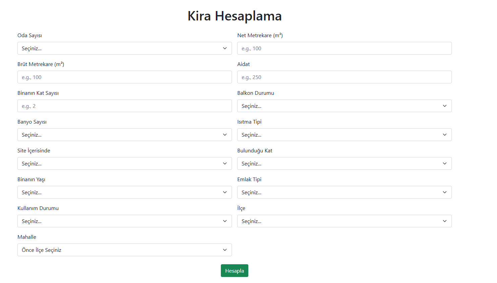

# XGBoost-based-Rent-Price-Prediction-in-Ankara
a machine learning approach based rent price prediction model in  Ankara/Turkey
Dataset

Includes property features such as:

Location (district & neighborhood)
Size (net / gross m²)
Number of rooms
Building age etc.

Process
Data cleaning & preprocessing
Address split into district & neighborhood
Missing value handling
Categorical encoding
Exploratory Data Analysis

Models

Multiple models were tested.
XGBoost Regressor achieved the best performance.

Optimized using:
Optuna
5-Fold Cross Validation

## template

  

Location strongly affects rental price

Larger size & room count → higher rent

Gated communities tend to be more expensive

🛠 Tech Stack

Python • Scikit-learn • XGBoost • Optuna • Pandas

